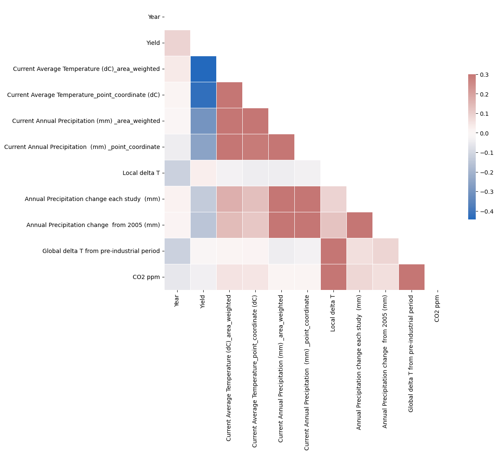
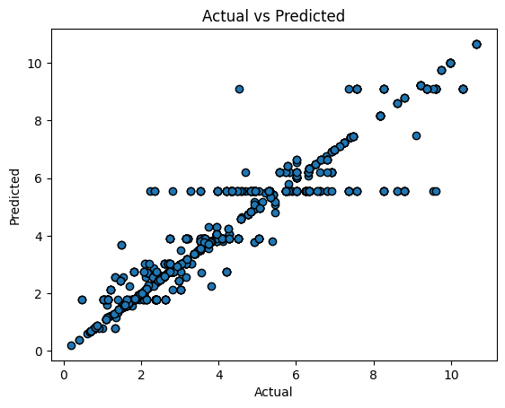

## NOTE
To run our code, visit our [Drive](https://drive.google.com/drive/u/0/folders/16qqch46JCskYGIB_uIdVTQ50uy2YP0Qd) and check out our `machine_learning_model.ipynb` file and `Statistical Tests` file.

# Predicting Crop Yield
In this model, we used a Decision Tree Regressor to predict the yield of three crops (rice, maize, and wheat) based on climate data. The following report addresses the questions posed:

1.  **Why did you use this ML algorithm?** 
	A Decision Tree Regressor is a non-parametric supervised learning method capable of finding complex nonlinear relationships in data. As there is a complex, nonlinear relationship between our climate data and crop yield, this method is desinged to find the desired realtionship between the two. Further, Decision Tree Regressor handle both categorical and continuous features, handle missing values, and for its ease of interpretation.
	Next, we employed k-fold cross validation to estimate the model's performance on unseen data as well as to avoid overfitting.
	Lastly, decision trees are also easy to interpret and visualize, which is useful in understanding the factors that contribute to the crop yield in the next part of our project.

	Specifically, we compared the R^2 score of different models (commented out portion of machine_learning_model.ipynb) to find the best model for the given task. The R2 (coefficient of determination) shows how well terms (data points) fit a curve or line. R^2 is a statistical measure between 0 and 1 which calculates how similar a regression line is to the data it’s fitted to.
	 If it’s a 1, the model 100% predicts the data variance; if it’s a 0, the model predicts none of the variance.
	Based on the results, Decision Tree Regressor produced the highest R2 score out of all the models. The R2 score is 0.998. This means that Decision Tree Regressor is the most fitting model for this task.

1. **Which other model did you consider or evaluate?**
We almost used Multiple Regression, a model used to explain the relationship between one continuous dependent variable and two or more independent variables. Ultimately, the data may not be linear, which would be required of multiple regression.

Also, as mentioned with regard to the R^2 score, we also considered other regression methods: Gradient Boosting Regressor, Random Forrest Regressor, and SVM regressor. 

3. **What metric(s) did you use to measure success or failure, and why did you use it?** 
Mean Squared Error (MSE) and Root Mean Squared Error (RMSE) were used to measure success or failure. These metrics are commonly used in regression problems and provide a measure of the model's prediction accuracy.

We also used the mean-cross validated score via the Grid Search Method with k-fold cross validation for predicting crop yield because it allows us to estimate the performance of the model on unseen data. Specifically, it found the best estimator to use via grid search. The mean-cross validated score is calculated by training the model on a portion of the available data and testing it on the remaining portion, repeating this process for each fold of the cross-validation. This helps to reduce the risk of overfitting the model to the training data and provides a more reliable estimate of its performance on new data.

Additionally, we used a plot of the Actual vs Predicted values to visually assess the relationship between the predicted and actual crop yields. This plot helps to identify any patterns or trends in the data that the model may have missed and can also indicate areas where the model needs improvement. For example, if the plot shows a consistent deviation from the line of perfect fit, it may indicate that the model is underestimating or overestimating crop yields.

4. **What challenges did you face evaluating the model? Did you have to clean or restructure your data?**
We had to preprocess the data. We had to idenitify which features were the most important in predicting crop yield. We also had to drop duplicates and null rows to clean the data. We also had to use one-hot encoding to change our categorical values to binary values. We also used MinMax scaling to ensure the values are normalized.

5. **What is your interpretation of the results? Are you satisfied with your prediction accuracy? We expect you to argue why you got the accuracy/success metric you have. Intuitively, how do you react to the results? Are you confident in the results?** 
The model was able to predict the yield of the crops with a reasonable/satisfactory degree of accuracy. Specifically, the MSE (mean squared error) value of ~0.4536 indicates the average squared difference between the actual yield and the predicted yield, with lower values indicating better performance. This MSE is a relatively low value, indicating that the model was able to learn the relationship between the independent variables and the dependent variable. The RMSE (root mean squared error) measures the average difference between the actual yield and the predicted yield. While the RMSE value of 0.6735 is not ideal, it is still within a reasonable range. The cross-validation score of 0.4262 indicates that the model is likely to perform similarly on new data, which increases confidence in its ability to generalize.

The plot also shows a generally good relationship between the actual and predicted yield. Therefore, we are fairly confident in the results. We also have seveal outliers, which is expected. These outliers demonstrate that our model is not overfitting, which is satisfactory.

6.   **Did you find the results corresponded with your initial belief in the data? If yes/no, why do you think this was the case?**
These results did correspond with our beliefs. We thought there would be a strong correlation between environmental data and crop yield. As our model accounts for a variety of different environmental data points and factors, we expected that we could predict yield with reasonable accuracy.

7. **Do you believe the tools for analysis that you chose were appropriate? If yes/no, why or what method could have been used?**
	The tools for analysis chosen were appropriate for the task at hand. We know this because we compared our R^2 scores between the aforementioned models, and the DTR matches the data the best. However, other methods such as Random Forest Regressor and Support Vector Regressor could have been used for comparison.
	
1. **Was the data adequate for your analysis? If not, what aspects of the data were problematic and how could you have remedied that?**
	The data was adequate for analysis but had missing values that had to be dealt with. There was also a lot of repetitve data entries. After getting rid of duplicates, we had less data, which could have resulted in some overfitting. However, generally, the data was accurate. Additionally, more features such as soil type and irrigation could have been included to improve the accuracy of the model.

# Statistical Tests

## Hypothesis 1: There is a correlation between annual precipitation and crop yield in the dataset.
1.  **Why did you use Pearson's Correlation?**
	The Pearson's correlation coefficient to measure the strength of the relationship between annual precipitation and crop yield. This means we will be comparing quantitative variables to find a linear relationship and seek to see if annual precipitation correlates at all with crop yield.
2. **Which other test did you consider?**
	We could have used a **one-sample t-test**. A one-sample t-test is a statistical test that is used to compare the mean of a sample to a known population mean. In this case, we would be comparing the mean annual precipitation of the countries in the dataset to a known crop yield mean.
3. **What metric(s) did you use to measure success or failure, and why did you use it?** 
The Pearson's correlation coefficient is a measure of the linear relationship between two variables. It ranges from -1 to 1, where -1 indicates a perfect negative correlation, 0 indicates no correlation, and 1 indicates a perfect positive correlation. We used this to invetigate the linear relationship between crop yield and precipitation. We also used the p-value to ensure our findings were significant.
4. **What challenges did you face evaluating the model? Did you have to clean or restructure your data?** 
At first, we had a questionable coefficient value and a p-value of 0. Upon investigating the data, we noticed that there are many repeated values in the precipitation column and the crop yield column. This is because our dataset contains separate entries for different regions in the same country, and many of these regions have similar values for precipitation and crop yield. We resolved this issue by removing the duplicate values separately in both columns. This resulted in less data overall but more reasonable coefficient value and p-value.
5. **What is your interpretation of the results? Do you accept or deny the hypothesis, or are you satisfied with your prediction accuracy?** 
The correlation coefficient is -0.209 and the p-value is 0.035, which means that there is a moderate negative correlation between annual precipitation and crop yield in the dataset. Since the p-value < 0.05, our result is statistically significant and we accept the hypothesis. We are satisfied with our prediction accuracy because our p-value indicates that our result is statistically significant.
6.  **Did you find the results corresponded with your initial belief in the data? If yes/no, why do you think this was the case?**
Intuitively, it seems like there would have been a positive correlation between precipitation and crop yield. One possible explanation for the negative correlation is that excessive precipitation can lead to waterlogging, soil erosion, and leaching of nutrients, which can negatively impact crop growth and yield. Additionally, too much moisture can promote the growth of pests and diseases, which can further harm crop health. 
7. **Do you believe the tools for analysis that you chose were appropriate? If yes/no, why or what method could have been used?**
	The tools for analysis chosen were appropriate as we sought to find a correlation between yield and precipitation. Because we are focusing on the linear relationship between the two specific variables, we believed that the Pearson correlation was the best tool to use. 
8. **Was the data adequate for your analysis? If not, what aspects of the data were problematic and how could you have remedied that?**
	The data was adequate for analysis. Overall, the ideal amount of precipitation depends on various factors such as crop type, soil quality, and climate, and it can vary widely between regions and seasons. As these were not represented in the statisical test, they could be accounted for in a separate ML model or other tests.

## Hypothesis 2: There is a significant difference in crop yield between countries that use irrigation and countries that don't use irrigation.
1. **Why did you use a two-sample t-test?**
	We used a two-sample t-test to compare the mean crop yield between countries that use irrigation and countries that don't use irrigation. Generally, this test is used to compare the means of two groups.
2. **Which other test did you consider?**
	We could have used an ANOVA test. It compares the means of two or more independent groups. In this case, we would be comparing the mean crop yield of countries that use irrigation to the mean crop yield of countries that don't use irrigation.
3. **What metric(s) did you use to measure success or failure, and why did you use it?** 
	We used mean crop yield. The mean crop yield is a measure of the average crop yield for a group of countries. 
	
	Explictly, if the mean crop yield of countries that use irrigation is higher than the mean crop yield of countries that don't use irrigation, then we can accept Hypothesis 2. If the mean crop yield of countries that use irrigation is lower than the mean crop yield of countries that don't use irrigation, then we deny hypothesis 2.

4. **What challenges did you face evaluating the model? Did you have to clean or restructure your data?** 
At first, we had a questionable coefficient value and a p-value of 0. Upon investigating the data, we noticed that there are repeated values in the crop yield column. This is because our dataset contains separate entries for different regions in the same country, and many of these regions have similar values for crop yield. We resolved this issue by removing rows that have the same values for both the crop yield and the irrigation columns. In this case, we couldn't remove the duplicate values in the two columns separately, since the irigation column only consist of Yes/No values. This change resulted in less data overall but more reasonable coefficient value and p-value.

5. **What is your interpretation of the results? Do you accept or deny the hypothesis, or are you satisfied with your prediction accuracy?** 
	The t-test coefficient for the mean crop yield between countries that use irrigation and countries that don't use irrigation was -2.290. This negative value means that the sample mean difference is negative, i.e., the mean of the first group is lower than the mean of the second group. The mean crop yield for countries that use irrigation is 2.356, while the mean crop yield for countries that don't use irrigation is 3.596. In conclusion, the countries that use irrigation have a lower mean crop yield than countries that don't use irrigation.
	The p-value for the t-test was 0.023. Since 0.023 < 0.05, our result is statistically significant and we accept the hypothesis.

1.  **Did you find the results corresponded with your initial belief in the data? If yes/no, why do you think this was the case?**
	Intuitively, it seems like there would be a significant difference between the crop yield of the two groups. However, we initially believed that irrigation would lead to higher crop yield. Irrigation provides a more consistent and reliable water supply for crops, which can increase yield. In contrast, countries that do not use irrigation may have to rely on rainwater or other sources of water, which can be unpredictable and lead to lower yields.
	
	Additionally, countries that use irrigation may have more advanced agricultural practices or technologies, which could contribute to higher yields. Countries that do not use irrigation may face other challenges that impact their yields, such as soil quality, pests, or climate conditions.

	In this sense, the result that countries that used irrigation had lower crop yield than countries that did not irrigation was surprising. One possible reason for this is that there isn't a linear relationship between irrigation and crop yield, and in order to find a more meaningful correlation, other environmental factors need to be considered. 

7. **Do you believe the tools for analysis that you chose were appropriate? If yes/no, why or what method could have been used?**
	The tools for analysis chosen were appropriate as we sought to find a significant difference between two samples (irrigation vs no-irrigation).

8. **Was the data adequate for your analysis? If not, what aspects of the data were problematic and how could you have remedied that?**
	The data was adequate for analysis. If we had joined our existing datasets on an irrigation dataset, we may have had more accurate results on the relationship between irrigation and crop yield. 

