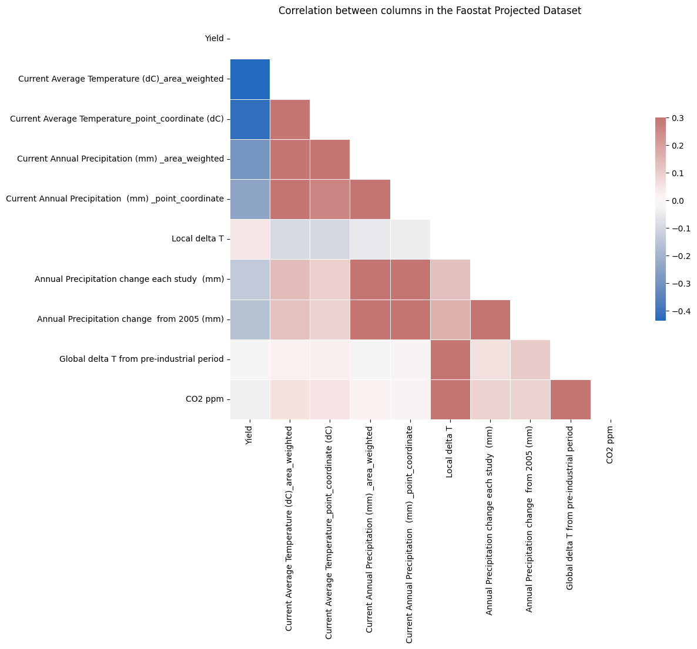
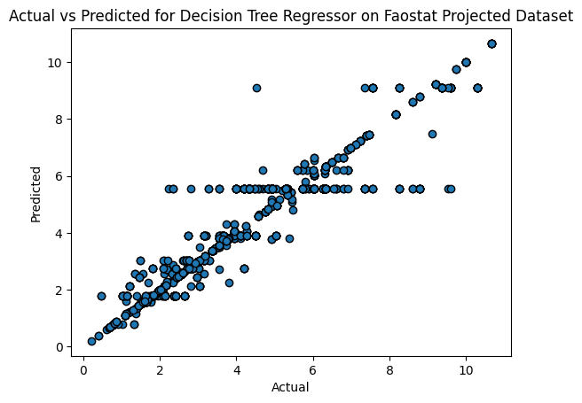

# Visualization 1 (Heatmap):

1. We picked this visualization because it shows clearly the correlation between different columns in the data, such as between the average temperature and yield.Since the dataset contains many columns, a heat map is useful for identifying columns with strong correlations to each other, as well as whether the correlation is positive or negative. 

2. Another way to show the correlation between different columns is through 2-D line plots, where x and y represent the two columns in question. A line plot would allow us to see if there exists any correlation between x and y.

3. One challenge was selecting which columns to include in the heatmap. Since we're focusing on correlation between columns, we chose the columns with numeric values and excluded the other ones. One column with numeric value that we excluded is Year, since Year isn't a relevant feature for our analysis and is also excluded from our model training and testing data.

4. The visualization is standalone, since the heatmap is clearly labeled with all the column names. 

# Visualization 2 (Scatter Plot):

1. We picked this visualization because it shows how closely aligned the actual yield values and the yield values predicted by our model are. The more the data points
on the plot form a straight line, the more the predicted and actual values are aligned. A scatter plot
is helpful because it shows all the data points, including both those that are close to the actual values and the outliers. 

2. Other ways to communicate the result include line plots and bar charts. Instead of showing the scatter points, we could create a line plot that plots a continuous line with x as Actual and y as Predicted. We could also create a bar chart that shows the actual and predicted values side by side.

3. The process of creating this plot was pretty straightforward, so there weren't any specific challenges.

4. It is standalone, since it has a title and labels for the x and y axis. The only thing that may require explanation is the unit used for the yield values, but it isn't strictly necessary for observing the relationship between Actual and Predicted values.